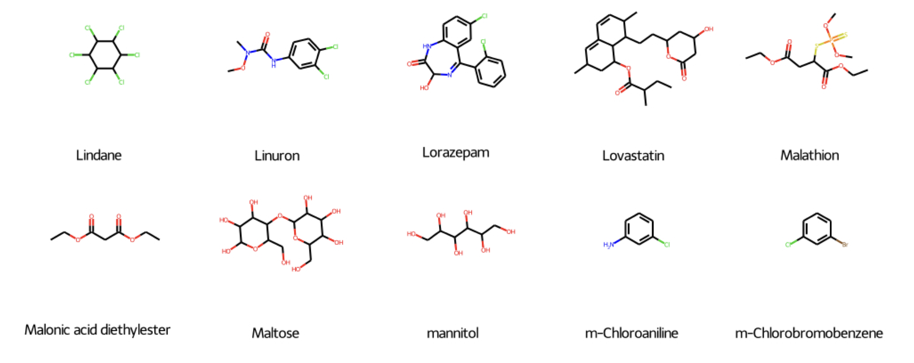
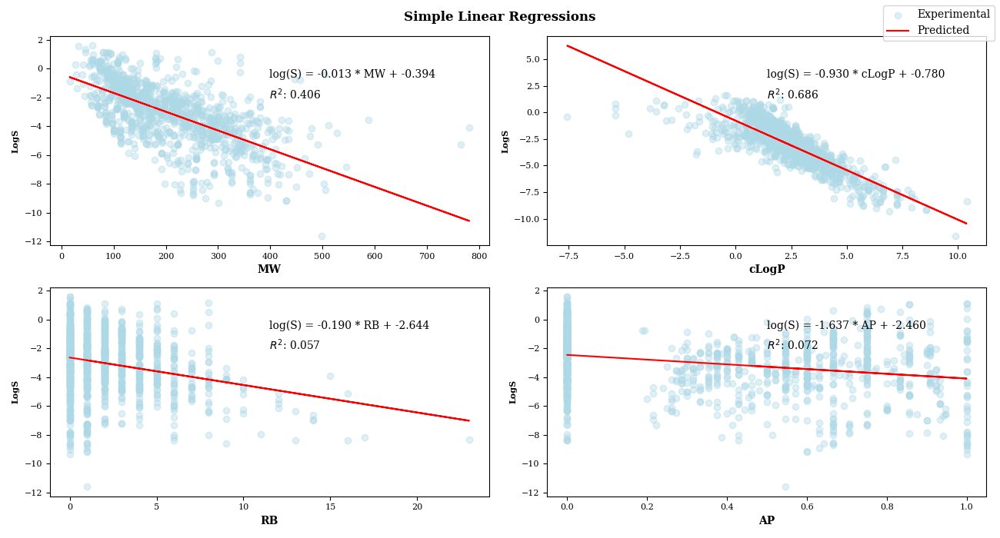
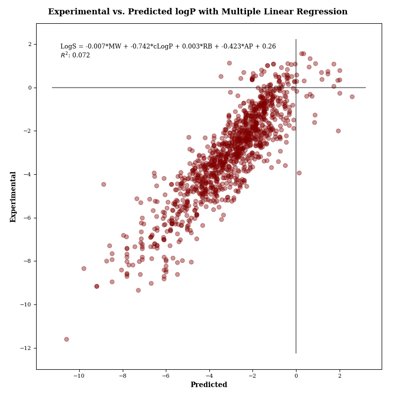

# Predicting Solubilities from Molecular Structure for Drug Discovery
Ian Sharff
## Table of Contents
- [Table of Contents](#table-of-contents)
- [Overview](#overview)
- [Project Structure](#project-structure)
- [Background](#background)
- [Data Understanding](#data-understanding)
- [Data Processing](#data-processing)
- [Model Training and Evaluation](#model-training-and-evaluation)
- [Discussion and Conclusions](#discussion-and-conclusions)
- [References](#References)

## Overview
This project is my first look into the task of predicting aqueous solubility of a compound with a machine-learning focused approach. As of now, it closely follows the work of John Delaney in using molecular properties as regressors for multiple linear regression. These properties were calculated in this study with the help of RDKit's Python API with great inspiration from Chanin Nantasenamat's blog post on the topic. This project is intended as a first step towards developing a more sophisticated regression model through expansion of features and utilization of more modern algorithms. Given the prominence of graph neural networks (GNN's) in the field of machine learning with molecular inputs, I ultimately would like to implement a GNN for this task.
## Project Structure
```
.
├── 01_FirstModels.ipynb    # Notebook with analysis, modeling and visualizations
├── LICENSE
├── README.md
├── data
│   ├── clean_data  # Pickled molecule objects and targets
│   ├── outputs
│   └── raw_data    # Unprocessed CSV files
├── generate_images.py  # Generate a PNG with molecule depictions
├── images  # Slide/notebook/molecule images
│   ├── plots # Saved PNGs from notebooks for presentation
│   └── notebook.mplstyle # Style Sheet
├── store_molecules.py  # Store molecules in a more retreivable format
└── tools
    └── helpers.py  # Miscellaneous helper functions
```
### Packages
- RDKit (molecular representations and calculations)
- Scikit-Learn (modeling)
- Matplotlib and Seaborn (visualizations)
- Numpy and Pandas (DataFrames and array manipulations)

## Background
In the context of pharmacology and drug discovery, aqueous solubility is an important property that can serve as an indicator for the biological uptake of a potential compound, and as such a multitude of attempts have been made at achieving a reliable model or formula for its prediction. For drug candidates under analysis in silico that may be unavailable for physical experimentation and measurement, a method to accurately and efficiently predict solubility is invaluable. The basis for this project rests upon "ESOL: Estimating Aqueous Solubility Directly from Molecular Structure," [1] a study by John Delaney published in 2004, and a beginning guide to implementing it with RDKit in Python is provided by Nantasenamat [2]. The General Solubility Equation [3], an important method for solubility prediction, relies upon two parameters: the octanol-water partition coefficient, LogP, and the melting point of the solute, Tm. The former can readily calculated using methods contained in the RDKit library, but the latter can be rather hard to predict [4]. As such, a method to estimate solubility directly from molecular structure could avoid this obstacle, and many different approaches have already been documented [5][6][7].
## Data Understanding
The 1,144 molecules in the dataset are represented as SMILES strings at `data/raw_data/delaney.csv` in the repository. This CSV file was obtained from Chanin Nantasenamat's GitHub at https://raw.githubusercontent.com/dataprofessor/data/master/delaney.csv. For visualizations of these molecules, the `generate_images.py` script can be run to output PNG files containing depictions of molecular structures with their associated names. These molecules are organic (some are named pharmaceutical compounds) and their chemical properties can be obtained through the `rdkit.Chem` library. For more complex future models, more data will likely be necessary.
## Data Processing
The SMILES strings are parsed using `rdkit.Chem.MolFromSmiles` to generate molecule objects which have a wealth of encapsulated operations for handling molecules and obtaining their properties. The four features obtained in this fashion for the purpose of multiple linear regression are
- Octanol-Water Partition Coefficient: "cLogP"
- Molecular Weight: "MW"
- Number of Rotatable Bonds: "RB"
- Aromatic Proportion: "AP"

## Model Training and Evaluation
Simple linear regressions were performed for each of the features followed by a multiple linear regression using all four features. Visualization of results with `matplotlib` along with code for creating the models can be found in `01_FirstModels.ipynb`. Linear regressions were implemented using the `sklearn.linear_model.LinearRegression` estimator, and the `sklearn` library will be used for generating other potential model candidates.



## Discussion and Conclusions
The multiple linear regression with all four features yielded an R-squared score of 0.770 which is similar to the results obtained by Delaney, even with a subset of the molecules used. 



The results have provided me with an insight into the nature of solubility prediction with machine learning techniques and readings on the subject have brought to my attention a number of other methods and datasets that could be potentially incorporated into this study. Some future goals for expansion and improvement as of now are

- Employing more robust Scikit-Learn algorithms on the current feature set and any expansions
- Leveraging RDKit to calculate a more descriptive feature set (taking into account things such as functional groups, H-bonding groups, hydrophilic/hydrophobic groups, etc.)
- Using chemical fingerprinting techniques in tandem with layered neural networks to allow learning-based feature extraction rather than determining features explicitly
- Researching and implementing a solution to the problem with a convolutional graph neural network (GNN), which could be a viable fit for the task

## References
1. Delaney, J. S. ESOL:  Estimating Aqueous Solubility Directly from Molecular Structure. Journal of Chemical Information and Computer Sciences 2004, 44 (3), 1000–1005.
2. Nantasenamat, C. How to Use Machine Learning for Drug Discovery. Medium, 2020. 
3. Ran, Y.; Jain, N.; Yalkowsky, S. H. Prediction of Aqueous Solubility of Organic Compounds by the General Solubility Equation (GSE). Journal of Chemical Information and Computer Sciences 2001, 41 (5), 1208–1217. 
4. Tetko, I. V.; Sushko, Y.; Novotarskyi, S.; Patiny, L.; Kondratov, I.; Petrenko, A. E.; Charochkina, L.; Asiri, A. M. How Accurately Can We Predict the Melting Points of Drug-like Compounds? Journal of Chemical Information and Modeling 2014, 54 (12), 3320–3329. 
5. Wang, J.; Hou, T.; Xu, X. Aqueous Solubility Prediction Based on Weighted Atom Type Counts and Solvent Accessible Surface Areas. Journal of Chemical Information and Modeling 2009, 49 (3), 571–581. 

6. Bergström, C. A. S.; Larsson, P. Computational Prediction of Drug Solubility in Water-Based Systems: Qualitative and Quantitative Approaches Used in the Current Drug Discovery and Development Setting. International Journal of Pharmaceutics 2018, 540 (1-2), 185–193. 

7. Kuentz, M.; Bergström, C. A. S. Synergistic Computational Modeling Approaches as Team Players in the Game of Solubility Predictions. Journal of Pharmaceutical Sciences 2021, 110 (1), 22–34. 
